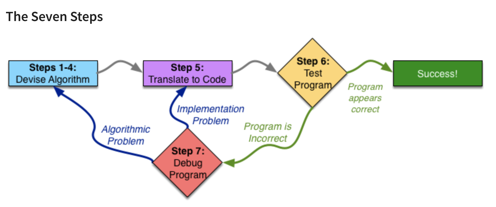
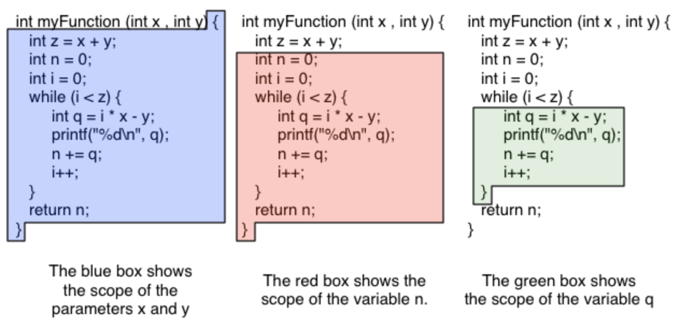

# 2. Programming Fundamentals

## Module 1 Introduction

### 1. 主要内容

这个module主要讲的用7个步骤（the Seven Steps）来系统的解决编程问题，并且规划出有针对性且正确的算法。

### 2. Seven Steps

#### I 课程的架构

学习怎么program，学习如何阅读代码

Course 1: seven steps -- 阅读代码中的syntax(句法，句法规则) and semantics(语义学；语义论)

Course 2: editing, compiling and running code; testing and debugging

Course 3: Pointers, arrays, and strings; recursion

Course 4: 和用户以及系统交互（IO系统）；动态内存规划（dynamic memory allocation）

#### II Programming: Plan First, Then Code

可以将 a large programming task 分解成several small tasks；30分钟的planning 可以相当于几个小时的try to make the code work properly

将写代码比做造模天大楼，需要现有完整的approved蓝图才能开始造：come up with a complete plan (algorithm) first and build (implement in code) second

编程的核心是解决一类问题而不是解决一个问题：当我们想知道7是不是prime的时候，我们会写一个程序去判断任意一个N是不是prime

我们需要确定特定的输入值，规定输入值的类型

在coding前，我们需要确定确切的algorithm

#### III Overview of the Seven Steps




### 3. The First Four Steps

#### Step 1: work an example yourself

就是自己想出一个特定的例子，比如在写一个判断N是不是质数的例子里，先假定N是7，然后把判断7是质数的过程想出来并且最好画一个图（draw a diagram）


Domain knowledge: 领域知识

#### Step 2 write down what you just did

就是写下一组清晰的说明，其他人都可以遵循，以重现你刚刚解决的特定问题实例的答案

难点在于会忽略一些小的细节

#### Step 3 generalize your steps

首先，我们必须取我们使用的特定值并用参数的数学表达式代替它们

概括步骤的第二种常见方法是寻找重复——相同的步骤反复重复

If you find it difficult to see a pattern, it is recommended to repeat steps 1 and 2 on different examples.

#### Step 4 test your algorithms


### 4. Examples

给了一个关于格子的example，可以进行直观地找规律

</br>

-----

## Module 2 Reading Code

### 1. 主要内容

主要学会阅读、理解、使用函数、条件语句、循环和其他基础的技巧

### 2. variables and expressions

先读一些好的代码，才能自己写好代码

`programs track most of their state in variables`

#### I decalaration

The name of a variable may be any `identifier`.

***Identifier***: the formal programming term for a word that can be used to name something in any programming language.

在C里面，identifier可以包含任何字母、数字和下划线_;只能用字母和下划线进行开头，不能使用数字开头！

一句declaration是以分号（semicolon）进行结尾的：

```c
int myVariable;
```

#### II assigning a variable (assignment statement)

一个statement的左边是lvalue

中间是一个equals sign (叫assignment operator)

右边是rvalue

Declaration 和 Assignment 可以合并成一个statement

#### III expression

expression的定义：an expression is a combination of values and operations which evaluates to a value

% modular：取余数，the modulus operator evaluates to the remainder when dividing the first operand by the second; 19%15 = 4 (读作19 modulus 或者mod 15 = 4)

**整数除法得到的是整数，而且是向下取整的整数，因为int类型只能存储整数**：floor division，round down the result，5 / 2 = 2


### 3. functions

如果我们重复写了两段类似的代码，那么我们就需要将代码概括成function了

优点：

1. can re-use
2. abstraction

declaring a function and call a function


#### I Frame

A ***frame*** (或者叫stack frame，因为他们位于call stack):


the expression involves a function call

#### II Scope

Scope 是用来解决一个大项目里有相同名称的变量问题的

In C, the scope of a local variable begins with its declaration and ends at the closing curly-brace (})

C里面一个局部变量的作用域是从declartion开始到}结束



### 4. printing

```c
int x = 3;
int y = 4;
printf("x + y = %d", x + y);
```

***escape sequences***: 即**转义符**

The most common escape sequence you will encounter is \n, which means “newline”.

\\\ is the escape sequence for a literal backslash

\t：tab

Format specifier: 类似%d这种符号

### 5. conditional statements

clause：从句

#### I if/else

"then" clause

"if" clause

#### II switch/case

注意只有在case里面遇到`break;`之后，程序的运行才会跳到下一个花括号！没有break的话，会继续运行下一个case！

或者碰到return 的话也可以直接跳出判断语句

举例：

```c++
# include <iostream>

using namespace std;

int main () {
    int x;
    cin >> x;
    switch (x) {
        case 1:
            printf("1\n");
            break;
        case 2:
            printf("2\n");
        case 3:
            printf("3\n");
            break;
        case 4:
            printf("4\n");
    }
    return 0;
}
```

运行结果：

```C++
输入1	
  1
输入2
  2
  3
```


#### III shorthand

Shorthand 又叫syntactic sugar

最常见的简略表达方式：

```c++
x += y;
x -= y;
x *= y;
x /= y;
x ++;
++x;
x--;
--x;
```


### 6. loops

for repitition


</br>

----

