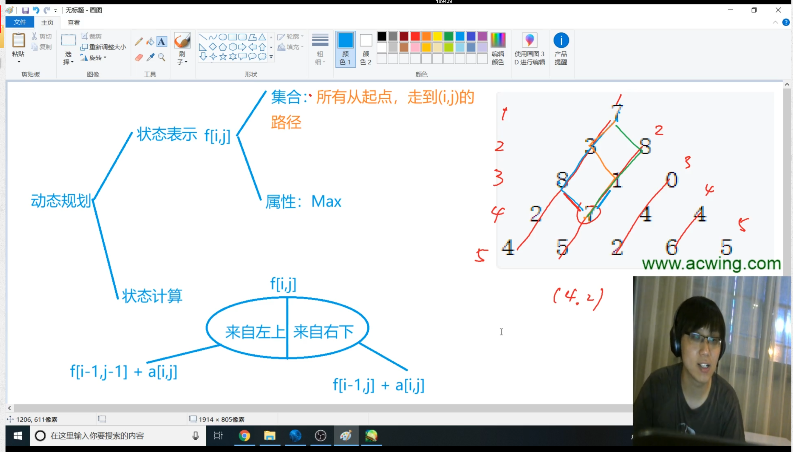

# 第五讲 动态规划

动态规划问题没有算法模板

状态转移方程

> 动态规划算法是一种用于解决优化问题的算法思想。它通过将问题分解为子问题，并以递推的方式求解子问题的最优解，从而得到原问题的最优解。
>
> 动态规划算法通常适用于满足最优子结构和重叠子问题性质的问题。最优子结构意味着问题的最优解可以由其子问题的最优解构成，而重叠子问题则指在求解过程中会反复遇到相同的子问题。
>
> 动态规划算法的基本步骤如下：
>
> 1. 定义状态：确定问题的状态表示，即找出需要存储的信息，以便进行后续的计算。
> 2. 确定状态转移方程：建立问题的状态之间的转移关系，即根据子问题的最优解推导出原问题的最优解。
> 3. 初始条件：确定问题的边界条件，即最简单的情况下的解。
> 4. 自底向上求解：按照自底向上的顺序，通过状态转移方程和已知的初始条件来计算并填充状态表格（或者直接更新状态数组）。
> 5. 提取结果：根据问题的要求，从最终的状态表格（或者状态数组）中提取出所需的结果。
>
> 动态规划算法在求解问题时，利用了子问题的重叠性质，避免了重复计算，从而显著提高了效率。它常常用于解决诸如最长公共子序列、背包问题、最短路径问题等优化问题。


## 1. 背包问题

并不一定要将背包完全装满

### 01背包问题（每件物品最多只用一次）

N个物品，和一个容量是V的背包

每个物品都有vi和价值wi，每个物品只能用一次

使背包中的物品价值最大


DP问题从两个角度来考虑

从集合的角度：

f(i, j) 表示的是集合中所有选法的最大值

1. 状态表示：需要几维数组来表示f(i,j)；集合（所有选法，条件（只考虑前i个物品、选出来总体积小于等于j））和属性（最大值、最小值、数量）

2. 状态计算：如何一步步算f(i, j) --集合的划分   f(i, j)如何用更小的集合划分：把f(i, j)分成两大类：不含第i个放到左边 （f(i -1, j）)、包含第i个放到右边去(f(i - 1, j - vi) + wi)
3. f(i, j) = max(f(i -1, j), f(i - 1, j - vi) + wi);

 f(i - 1, j - vi) + wi 是有可能不存在的，wi可能大于最大限制，那么就是空集了

动态规划的网上思维方式结构、状态、最后子结构太抽象了

### 01背包问题
#### 二维写法

```cpp
#include <iostream>
#include <algorithm>
using namespace std;
const int N = 1010;
int n, m;
int v[N], w[N];
int f[N][N]; // f[a][b]表示的是对于a个物品，b的最大容量，所能装的最大价值


int main () {
    cin >> n >> m;
    for (int i = 1; i <= n; i++) cin >> v[i] >> w[i];
    // 因为f[0][0~m]全局变量本身就是0，就不对他赋值了
    for (int i = 1; i <= n; i++) {
        for (int j = 0; j <= m; j++) {
            f[i][j] = f[i - 1][j];
            if (j >= v[i]) f[i][j] = max(f[i][j], f[i - 1][j - v[i]] + w[i]);
        }
    }
    cout << f[n][m] << endl;
    return 0;
}
```


f[i]这一层在更新的时候只用到了f[i - 1]层，所以可以使用滚动数组来做

注意到在更新f[x] [j]的时候的体积只和j或者j - v[i]相关

注意在修改f[j - v[i]]的时候如果j是从前往后排的话，那么后面的f[j]用到的就不是原来的f[j - v[i]]了，所以需要从后往前遍历


#### 滚动数组的概念

如果一个数组中从f[0]到f[n]每一个数值都只和前一个数有关，比如f[5]只和f[4]有关

考虑一下这个等式`f[n] = f[n - 1] + 2`

那么实际上我们开数组的空间并不需要开f[0~n]

而只要开f[0]和f[1]就行，然后两个之间互相更新


进行朴素的思考过程来排除从前往后进行遍历：

v[1] = 2, w[1] = 3

v[2]  = 2, w[2] = 6

最大的容量是4

所以如果从前往后遍历，那么第一次的结果是

f[2] = 3, f[4] = 3

第二次的结果是

f[2] = 6, f[4] = 12

而12是明显不正确的，因为用了更新之后的f[2]（即二维写法之中的`f[i][j - v[i]]`而不是需要的`f[i - 1][j - v[i]]`）

所以我们需要从后往前进行更新


#### 一维写法

```cpp
#include <iostream>
#include <algorithm>
using namespace std;

const int N = 1010;
int n, m;
int v[N], w[N];
int f[N]; 

int main () {
    cin >> n >> m;
    for (int i = 1; i <= n; i ++) cin >> v[i] >> w[i];
    for (int i = 1; i <= n; i++) {
        for (int j = m; j >= v[i]; j--) {
            f[j] = max(f[j], f[j - v[i]] + w[i]);
        }
    }
    cout << f[m] << endl;
    return 0;
}
```


### 完全背包问题（每件物品可用无限次）

完全背包问题的思考方式

状态表示和状态计算两个角度进行思考


状态表示：`f[i][j]` 

集合：所有只考虑前i个物品，且总体积不大于j的所有选法

属性：所有选法的总价值的最大值


状态计算：

集合的划分：

按物品有多少个来分（第i个物品选k个知道v[i] * k <= m）


曲线救国，三步来走

1. 去掉k个物品i
2. 求Max(f[i - 1, j - k * v[i]])
3. 再加回来k个物品i


#### 朴素做法（不推荐，太慢了）

```cpp
#include <iostream>
#include <algorithm>
using namespace std;
const int N = 1010;
int n, m;
int v[N], w[N];
int f[N][N];

int main () {
    cin >> n >>m;
    for (int i = 1; i <= n; i++) cin >> v[i] >> w[i];
    for (int i = 1; i <= n; i++) {
        for (int j = 0; j <= m; j++) {
            for (int k = 0; k * v[i] <= j; k++) {
                f[i][j] = max(f[i][j], f[i - 1][j - v[i] * k] + w[i] * k);
            }
        }
    }
    cout << f[n][m] << endl;
    return 0;
}
```


#### 优化成两维

考虑`f[i, j] = f[i - 1, j - v[i] * k] + w[i] * k`

`f[i, j]  = Max(f[i - 1, j], f[i - 1][j - v] + w, f[i - 1][j - 2v] + 2w, ...)`

`f[i, j - v] = Max(        f[i - 1][j-v], f[i - 1][j - 2v] + w)`

注意f[i, j]比f[i, j - v]多出了w

```cpp
#include <iostream>
#include <algorithm>
using namespace std;
const int N = 1010;
int n, m;
int v[N], w[N];
int f[N][N];

int main () {
    cin >> n >>m;
    for (int i = 1; i <= n; i++) cin >> v[i] >> w[i];
    for (int i = 1; i <= n; i++) {
        for (int j = 0; j <= m; j++) {
            f[i][j] = f[i - 1][j];
            if (j >= v[i]) f[i][j] = max(f[i][j], f[i][j - v[i]] + w[i]);
        }
    }
    cout << f[n][m] << endl;
    return 0;
}
```


#### 转化为一维

因为这里实际上需要对k个物品进行累加的

所以这里更新的时候是从前往后进行更新的

区别在于01背包问题是通过f[i - 1]进行更新的，所以不能先更新前面

而完全背包问题是通过f[i]进行更新的，所以不需要从后往前进行更新

```cpp
#include <iostream>
#include <algorithm>
using namespace std;
const int N = 1010;
int n, m;
int v[N], w[N];
int f[N];

int main () {
    cin >> n >>m;
    for (int i = 1; i <= n; i++) cin >> v[i] >> w[i];
    for (int i = 1; i <= n; i++) {
        for (int j = v[i]; j <= m; j++) {
            // f[j] = f[j];
            f[j] = max(f[j], f[j - v[i]] + w[i]);
        }
    }
    cout << f[m] << endl;
    return 0;
}
```


### 多重背包问题（每个物品个数不一样）

考虑两个方面

#### 状态表示：f[i, j]

集合：所有只从前i个物品中选，并且总体积不超过j的选法

属性：集合当中每一个选法对应的总价值的最大值

#### 状态计算

枚举一下第i个物品选多少个

#### 朴素做法

```cpp
#include <iostream>
#include <algorithm>

using namespace std;
const int N = 1010;
int n, m;
int v[N], w[N], s[N];
int f[N][N];

int main () {
    cin >> n >> m;
    for (int i = 1; i <= n; i++) cin >> v[i] >> w[i] >> s[i];
    for (int i = 1; i <= n; i++) {
        for (int j = 0; j <= m; j ++) {
            for (int k = 0; k <= s[i] && k * v[i] <= j; k++) {
                f[i][j] = max(f[i][j], f[i - 1][j - k * v[i]] + w[i] * k);
            }
        }
    }
    cout << f[n][m] << endl;
    return 0;
}
```


### 多重背包问题2（二进制经典优化版）

C++一秒钟最多算一亿次


所以对多重背包问题的优化是将多种物品的n个的个数拆成多个种类的物品

比如输入了一个体积是2，价值是3，数量是9的种类的东西、

那么我们实际上可以将他们拆成体积、价值、数量分别是：

2, 3（1）

4, 6（2）

8,12（4）

4, 6（2）

这四个组的物品

然后对他们进行01背包问题的讨论就行了


使用的是二进制得优化方式

使用1, 2, 4, 8, ... , 512拼凑出物品的所有的方案logn的做法

比如200 = 1 + 2 + 4 + 8 + 16 + 32 + 64 + 73

一般的s，实现拆成logs个组，然后对拆好后的组进行01背包问题的讨论即可：

1, 2, 4, 8, ...2^k, c

原来的时间复杂度是nvs

现在的时间复杂度是nvlogs


代码：

```cpp
#include <iostream>
#include <algorithm>
using namespace std;
const int N = 14000; // 组数等于1000 * log2000 = 12000

int n, m;
int v[N], w[N];
int f[N];
int main () {
    cin >> n >> m;
    int cnt = 0;
    for (int i = 1; i <= n; i++) {
        int a, b, s;
        cin >> a >> b >> s;
        int k = 1;
        while(k <= s) {
            cnt ++;
            v[cnt] = a * k;
            w[cnt] = b * k;
            s -= k;
            k *= 2;
        }
        if (s > 0) {
            cnt ++;
            v[cnt] = a * s;
            w[cnt] = b * s;
        }
    }
    n = cnt;
    for (int i = 1; i <= n; i++) {
        for (int j = m; j >= v[i]; j--) {
            f[j] = max(f[j], f[j - v[i]] + w[i]);
        }
    }
    cout << f[m] << endl;
    return 0;
}
```


### 分组背包问题（物品有n组，每组里面若干个，每组只能选一个）

分组背包问题

状态表示`f[i][j]`

集合：只从前i组物品中选且总体积不大于j的所有选法

属性：集合当中所有选法价值的最大值


状态计算

集合划分

枚举第i组物品选哪一个或者不选，划分成不选第i组的物品、选第i组的第一个物品、选第i组的第二个物品

对于不从里面选的情况来说，`f[i][j] = f[i - 1][j]`

对于需要从里面选的情况来说，`f[i - 1, j - v[i][k]] + w[i, k]`


```cpp
#include <iostream>
#include <algorithm>

using namespace std;

const int N = 110;
int n, m;
int v[N][N], w[N][N], s[N];
int f[N];

int main () {
    cin >> n >> m;
    for (int i = 1; i <= n; i++) {
        cin >> s[i];
        for (int j = 0; j < s[i]; j++) {
            cin >> v[i][j] >> w[i][j];
        }
    }
    for (int i = 1; i <= n; i++) { // i表示第i组物品
        for (int j = m; j >= 0; j--) { // j表示容量为j
            for (int k = 0; k < s[i]; k++) { // k表示第k个物品
                if (v[i][k] <= j) {
                    f[j] = max(f[j], f[j - v[i][k]] + w[i][k]);
                }
            }
        }
    }
    
    cout << f[m] << endl;
    
    return 0;
}
```


## 2. 线性dp

什么是线性dp：递推方程有一个明显的线性关系，有可能一维线性也有可能二维线性

dp没有模板，核心是状态表示和状态转移方程上


### 数字三角形

下标从1开始和从0开始取决于会不会调用到f[i - 1]，如果有f[i - 1]那么下标从1开始比较好


三角形的行数就是一层一层地看，三角形的列数要斜着看


状态表示：

集合：所有从起点走到(i, j) 的路径

属性：所有路径上数字之和的最大值Max


状态计算：（没有固定方式，只有经验）

f[i, j]分成两类：从左上来的，和从右上方来的

从左上来：f[i - 1, j -1] + a[i, j]

从右上方来：f[i - 1, j] + a[i, j]




动态规划问题的时间复杂度一般是状态数量*转移的计算量

```cpp
#include <iostream>
#include <algorithm>
using namespace std;
const int INF = 1e9, N = 510;
int n;
int a[N][N];
int f[N][N];

int main () {
    scanf("%d", &n);
    for (int i = 1; i <= n; i++) {
        for (int j = 1; j <= i; j++) {
            scanf("%d", &a[i][j]);
        }
    }
    
    for (int i = 0; i <= n; i++) {
        for (int j = 0; j <= n; j++) {
            f[i][j] = -INF;
        }
    }
    f[1][1] = a[1][1];
    for (int i = 2; i <= n; i++) {
        for (int j = 1; j <= i; j++) {
            f[i][j] = max(f[i - 1][j -1] + a[i][j], f[i - 1][j] + a[i][j]);
        }
    }
    int res = -INF;
    for (int i = 1; i <= n; i++) res = max(res, f[n][i]);
    printf("%d\n", res);
    return 0;
    
}

```


### 最长上升子序列

时间复杂度是O(n^2)


思考问题维度的时候要从小往大考虑

可以发现这个题目一维数组就可表示出来


状态表示

集合：所有以第i个数结尾的数值上升的子序列的集合

> 比如：3121856这个序列中，f[5]就是所有以8结尾的上升子序列：18  28  38  128

属性：集合里每一上升子序列长度的最大值


状态计算：

集合划分：以上升序列中i前面那个数来分类，所以就有1-i-1种分类


```cpp
#include <iostream>
#include <algorithm>

using namespace std;
const int N = 1000;
int n;
int a[N], f[N];

int main () {
    scanf("%d", &n);
    for (int i = 1; i <= n; i++) scanf("%d", &a[i]);

    for (int i = 1; i <= n; i++) {
        f[i] = 1;
        for (int j = 1; j < i; j++) {
            if (a[i] > a[j]) {
                f[i] = max(f[i], f[j] + 1);
            }
        }
    }
    int res = 1;
    for (int i = 1; i <= n; i++) {
        res = max(res, f[i]);
    }
    cout << res << endl;
    return 0;
}
```


### 最长上升子序列2


### 最长公共子序列

注意是字符串的公共子序列，不是单调递增的数字

状态表示：两维数组

集合：f[i, j]所有在第一个序列的前i个字母出现，且在第二个序列的前j个字母中出现的公共子序列

属性：所有这些子序列的max


状态计算：是以a[i] b[j]是否包含在子序列当中来作为划分的依据，一共是4种情况

都不包含：f[i -1, j -1] 但是实际上这种情况代码中不用写，因为被包含在了中间两种的情况里了

f[i -1, j]

f[i, j -1]

都包含f[i - 1, j - 1] + 1

注意以上四个集合是有重合的，主要是中间两个集合是有重合的，但是求max的时候是可以重合的，但不能漏


`f[n][m]`表示同时在a中前n个字母和b中前m个字母中出现的最长的子序列


```cpp
#include <iostream>
#include <algorithm>
using namespace std;
const int N = 1010;
int n, m;
char a[N], b[N];
int f[N][N];

int main () {
    cin >> n >> m;
    scanf("%s%s", a + 1, b + 1);
    for (int i = 1; i <= n; i++) {
        for (int j = 1; j <= m; j++) {
            f[i][j] = max(f[i - 1][j], f[i][j - 1]);
            if (a[i] == b[j]) f[i][j] = max(f[i][j], f[i - 1][j - 1] + 1);
            printf("%c %c %d\n", a[i], b[j], f[i][j]); // 可以通过这种方法来看过程
        }
    }
    printf("%d\n", f[n][m]); 
    return 0;
}
```


### 最短编辑距离


动态规划时间复杂度低的原因是可以用一个数去表示一堆状态，所以比较快

状态表示：

集合：所有将a[1-i]的变成b[1-j]的所有操作方法

属性：操作次数最小值

状态计算：f[i, j]


分类：

操作一：删除a[i]

把a[i] 删掉才能匹配

`f[i - 1, j] + 1`


操作二：增加一个字符

`f[i][j - 1] + 1`


操作三：改一个字符（这个情况中也包含了不改字符）

如果是改一个字符，就相当于两个字符串各自前面的相互匹配

f[i - 1, j - 1] + 1（需要改字符）或者+0（不许要改字符）


所以`f[i, j] = min(f[i - 1, j] + 1, f[i, j - 1] + 1, f[i - 1, j - 1] + 1 / 0)`


时间复杂度的计算：状态数量是n^2 每次计算3个数即可，所以O(n ^ 2)


### 编辑距离

