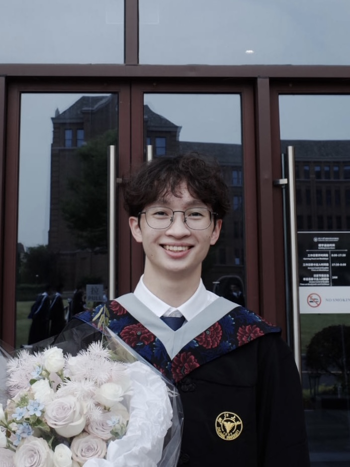

# About Me
  <head>
    <meta charset="UTF-8">
    <meta http-equiv="X-UA-Compatible" content="IE=Edge">
    <title>about me</title>
    
  </head>

  <body>
    

    	<figure> 
        
    </figure>
    

    

      
<b>Charles Chi Le </b> (乐驰 in simplified Chinese)

    	

        Hi there! I am currently a Master's Student in <a href="https://ece.duke.edu/masters/degrees/meng">Electrical and Computer Engineering</a> with a concentration in software development at <a href="https://duke.edu/">Duke University </a>. 
      

      
I graduated from <a href="https://www.zju.edu.cn/">Zhejiang University (ZJU) </a> and  <a href="https://www.ed.ac.uk/">the University of Edinburgh (UoE) </a>in June 2022. I received dual bachelor's degrees in Biomedical Sciences from both ZJU and UoE. 

      

        I am also an enthusiastic self-learner and interested in various fields of computer science. Here are my <a href="https://charleschile.com/Course/">course notes</a> for all the courses that I have taken where I share my self-learning experiences and resources. 
      

      

        For future career interests, I am particularly interested in backend software engineering.

        
        
      

      

        <b>Contact Me:</b>
        <ul>
        <li><a href="LeChi resume.pdf">CV</a></li>
        <li><a href="乐驰中文简历.pdf">中文简历</a></li>
        <li><a href="https://github.com/charleschile">Github</a></li>
        <li><a href="mailto:charles.chi.le@outlook.com">Email</a></li>
        </ul>
      

      

        <b>Professional Experiences:</b>
        <ul>
        <li>Incoming Backend Software Development Engineer Intern @ <a href="https://www.meituan.com/">MeiTuan</a> - Food Delivery Advertising Engine Team & Advertising Basic Retrieval Team</li>
        </ul>
      

      
      
    

  </body>

  
